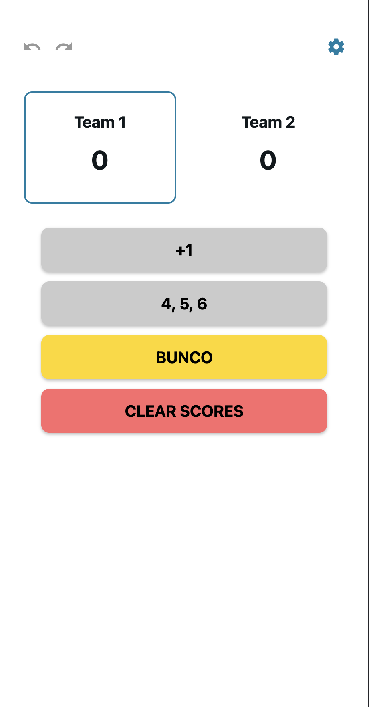
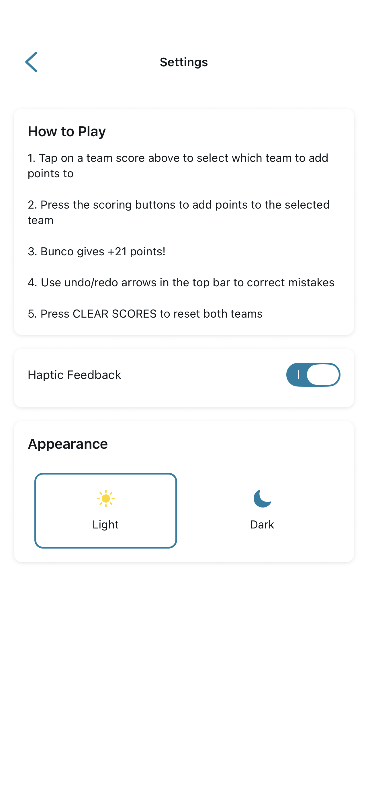

# Bunco Game Controller

A simple and clean mobile app for controlling Bunco games. Keep track of team scores with easy-to-use buttons for +1, +5, +11, and BUNCO (+21) points.

## How and Why

- I created this simple app using React Native and Expo, which allowed me to easily set it up to use on a mobile device.
- I wanted to learn how to interact with a framework and see the whole process of developing an application.

#### Process
- I started by going over the [React Native Environment setup](https://reactnative.dev/docs/environment-setup); it was here that I started an [Expo](https://expo.dev) project.
- Once I had the structure of an Expo project, I gave a list of specifications for `Grok Fast` to complete.
- Grok gave me a very good looking application, and I was able to dive into the code and alter code to fit my needs.
   - I wanted to change some of the names of the buttons.
   - The 'BUNCO' button had subtitle text that I didn't want.
   - The 'How to Play' menu didn't need to be on the main screen.
   - Padding looked a little funky and needed some bounds changed.
- The next thing to accomplish is to turn this into an application I can locally run on my phone, and to learn the process that requires.


## Features

- **Team Score Tracking**: Select a team and add points with large, clear buttons
- **Dark/Light Mode**: Toggle between themes with the sun/moon icon
- **Settings**: Reset scores and access future customization options
- **Responsive Design**: Works on iOS, Android, and web

## Known Bugs
- Dark and Light mode do not change style as expected; need some adjustment.

## How to Play

1. Tap on a team score box to select which team receives points
2. Press the scoring buttons to add points:
   - +1 for regular scoring
   - +5 for five of a kind
   - 4, 5, 6 (+11) for six of a kind
   - BUNCO (+21) for rolling three of a kind of the target number (round number)

## Getting Started

1. Install dependencies
   ```bash
   npm install
   ```

2. Start the app
   ```bash
   npx expo start
   ```

3. Open in Expo Go, simulator, or web browser

## Application View
<!-- 

 -->

<div style="display: flex; gap: 10px;">
  
  
  
</div>

